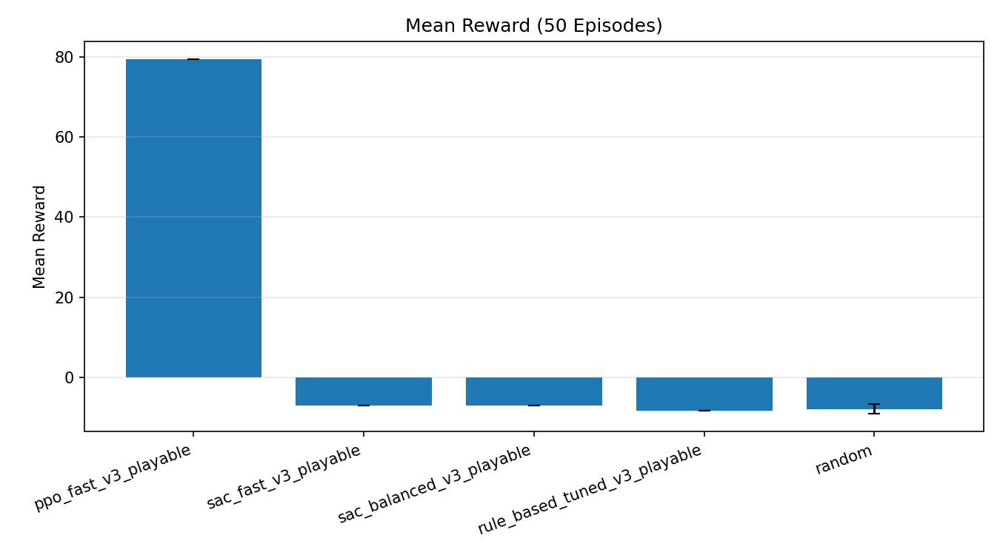
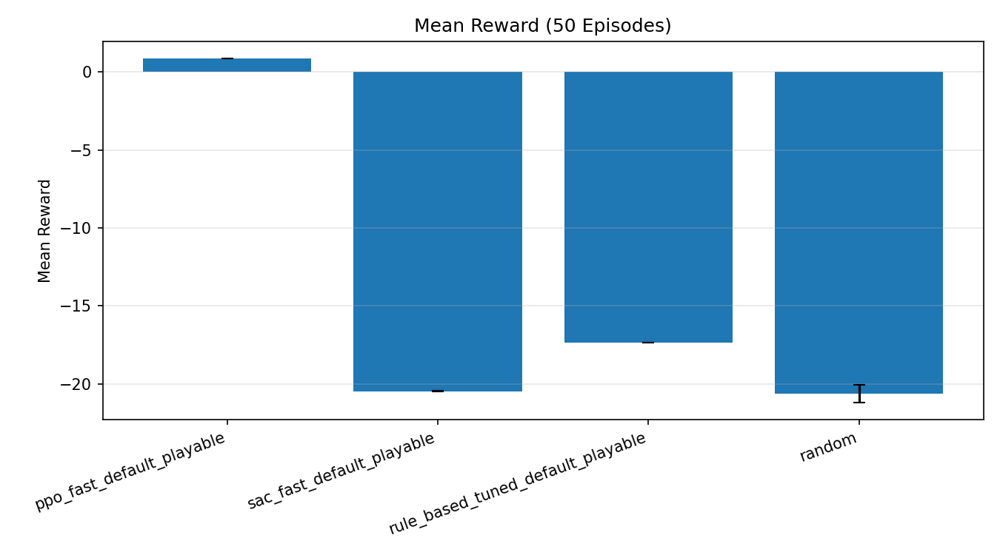

# Executive Summary: PPO vs SAC (Playable Steering)

## Scope
We re-ran comparisons after the steering/physics updates using two configs:
- **fast_iter_v3**: quick iteration track for rapid feedback.
- **default**: longer track with higher checkpoint counts.

All numbers below are **50-episode evaluations** with deterministic policies.

## Topline Results
- **PPO dominates** both configs, achieving high checkpoint counts and **0% collision rate**.
- **SAC (fast/balanced)** underperformed under short training budgets; it consistently collided.
- **Rule-based baseline** is stable but still collides; it�s a useful floor, not a target.

## Quick Visuals
### fast_iter_v3 (Playable)

### default (Playable)

## Resume-Ready Highlights
- **PPO (fast_iter_v3)**: mean reward **79.49**, **32 checkpoints**, **0% collisions**.
- **PPO (default)**: mean reward **0.86**, **88 checkpoints**, **0% collisions**.

## Notes on SAC
SAC runs were intentionally short to keep iteration fast. The data shows SAC needs more steps and/or reward shaping to reduce collisions.

## Recommended Next Steps
- Extend SAC training budget (=100k�200k) and retune `learning_rate`/`batch_size`.
- Add a mild speed penalty near walls to incentivize safer control.
- Track action histograms (throttle/steer) to spot saturation.
