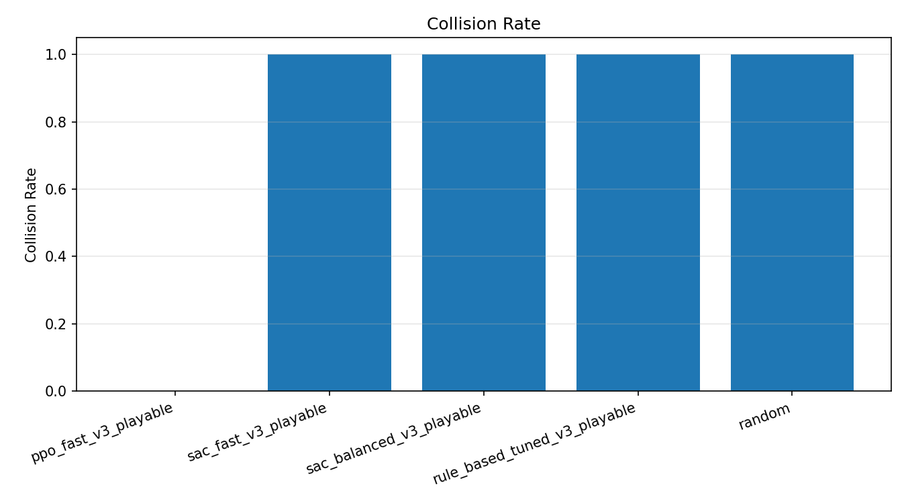
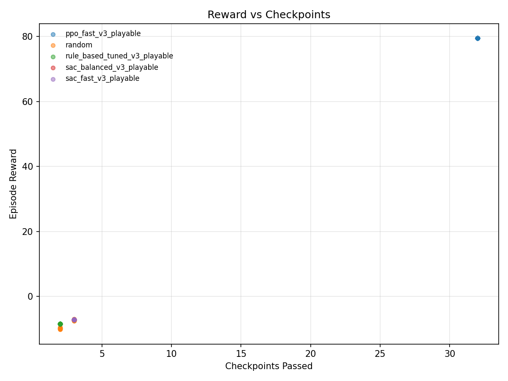

# fast_iter_v3: PPO vs SAC (Playable Steering)

## Setup
- **Config:** `configs/fast_iter_v3.yaml`
- **Eval:** 50 episodes, deterministic policy
- **Agents:** PPO (fast), SAC (fast + balanced), tuned rule-based, random

## Key Takeaways
- PPO is **clean and consistent**: 0% collisions, highest checkpoints.
- SAC variants **collide on every run** at current budgets.
- Rule-based is stable but still collides; it�s a diagnostic baseline.

## Metrics Snapshot
| Agent | Mean Reward | Mean Checkpoints | Collision Rate | Mean Steps |
| --- | ---:| ---:| ---:| ---:|
| PPO fast | 79.49 | 32.0 | 0.00 | 400 |
| SAC fast | -7.09 | 3.0 | 1.00 | 90 |
| SAC balanced | -7.07 | 3.0 | 1.00 | 92 |
| Rule-based tuned | -8.45 | 2.0 | 1.00 | 63 |
| Random | -7.99 | 2.7 | 1.00 | 91 |

## Visuals
### Mean Reward

### Collision Rate

### Reward vs Checkpoints

### Rule-Based Grid (Reward Surface)

## Interpretation
PPO learns to maintain speed while avoiding walls. SAC currently collapses into collision-heavy behavior, likely from insufficient training and missing near-wall speed penalties.
