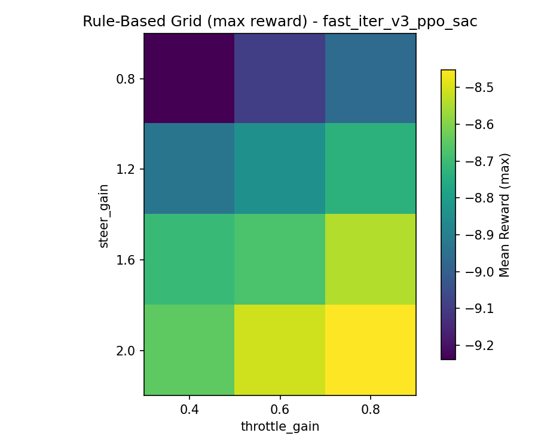
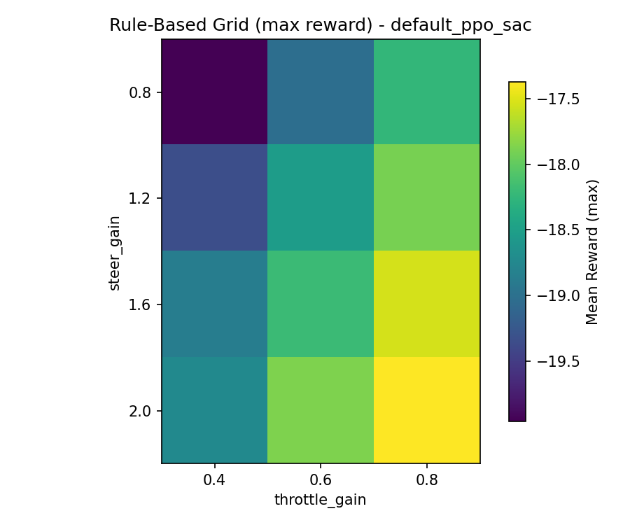

# Rule-Based Baselines (Tuned)

## Summary
Rule-based policies were grid-searched over steering and throttle gains. They provide a stable floor but still collide reliably under the current reward structure.

## Best Params (fast_iter_v3)
- `steer_gain`: **2.0**
- `throttle_base`: **0.3**
- `throttle_gain`: **0.8**
- `brake_dist`: **0.4**
- `throttle_min`: **0.0**
- **Mean reward:** -8.45 (50-episode eval)

## Best Params (default)
- `steer_gain`: **2.0**
- `throttle_base`: **0.3**
- `throttle_gain`: **0.8**
- `brake_dist`: **0.3**
- `throttle_min`: **0.0**
- **Mean reward:** -17.37 (50-episode eval)

## Heatmaps
### fast_iter_v3

### default

## Interpretation
The rule-based controller tends to over-commit throttle and clip walls. It�s useful for sanity checks but not competitive with PPO.
