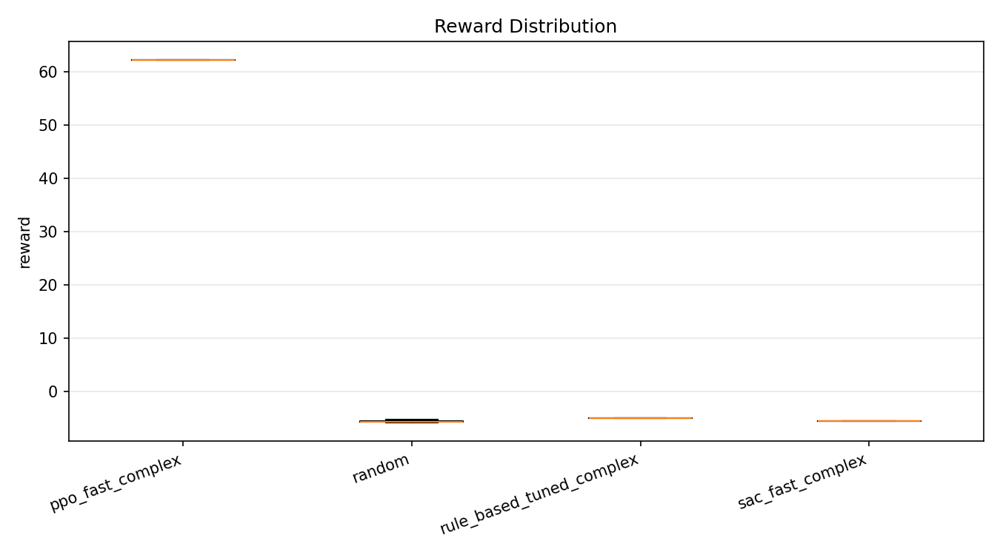
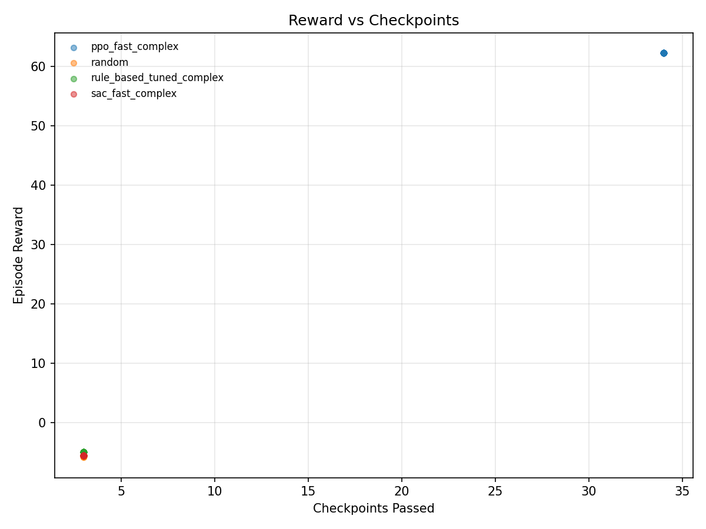

# Wavy Track: PPO vs SAC (Phase 1 Part 2)

## Setup
- **Config:** `configs/fast_iter_v3_complex_long.yaml`
- **Eval:** 50 episodes, deterministic
- **Agents:** PPO (fast), SAC (fast), tuned rule-based, random

## Metrics Snapshot
| Agent | Mean Reward | Mean Checkpoints | Collision Rate | Mean Steps | Mean Speed |
| --- | ---:| ---:| ---:| ---:| ---:|
| PPO fast | 62.21 | 34.0 | 0.00 | 800 | 72.59 |
| SAC fast | -5.51 | 3.0 | 1.00 | 104 | 69.01 |
| Rule-based tuned | -4.97 | 3.0 | 1.00 | 83 | 83.91 |
| Random | -5.59 | 3.0 | 1.00 | 106 | 67.96 |

## Visuals
### Mean Reward

### Reward Distribution

### Reward vs Checkpoints

## Interpretation
- PPO is the only policy that consistently finishes full episodes without collisions.
- SAC under short training budgets collapses into early collisions.
- The wavy geometry increases difficulty; a longer episode horizon helps PPO complete a full lap.
