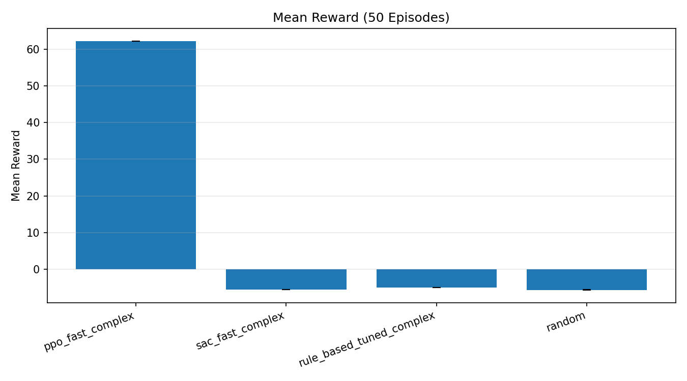
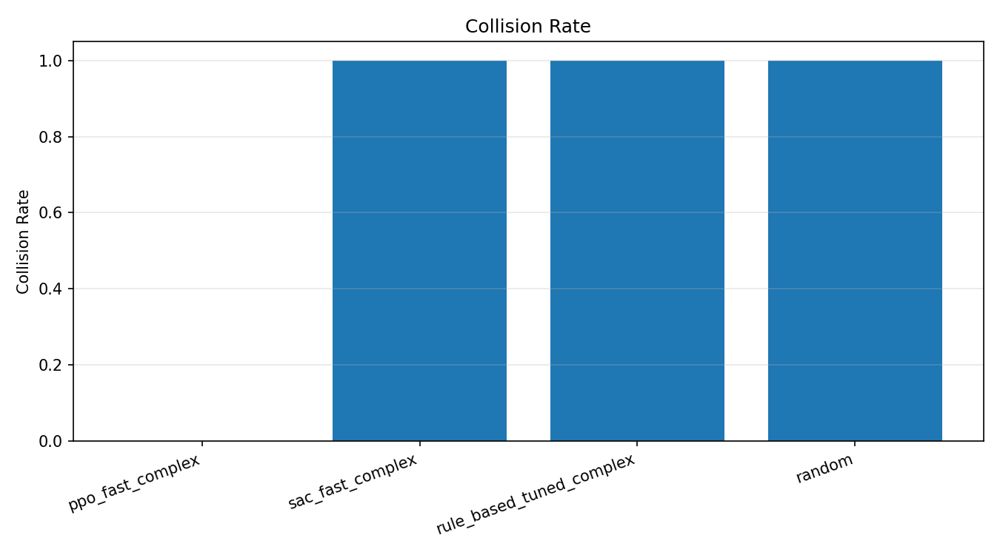

# Executive Summary: Phase 1 Part 2 (Wavy Track)

## Scope
This report covers the wavy-track variant (Phase 1, Part 2) using the longer episode config:
- Config: `configs/fast_iter_v3_complex_long.yaml` (800 steps)

## Topline Results
- **PPO is stable and collision-free** on the wavy track.
- **SAC and rule-based baselines collide** under short budgets.
- A longer episode length enables **full-lap completion** with the PPO model.

## Key Metrics (50-episode eval)
| Agent | Mean Reward | Mean Checkpoints | Collision Rate | Mean Steps |
| --- | ---:| ---:| ---:| ---:|
| PPO fast | 62.21 | 34.0 | 0.00 | 800 |
| SAC fast | -5.51 | 3.0 | 1.00 | 104 |
| Rule-based tuned | -4.97 | 3.0 | 1.00 | 83 |
| Random | -5.59 | 3.0 | 1.00 | 106 |

## Lap Completion Check
Using an extended episode length (1500 steps), the **same PPO model** achieves:
- Mean checkpoints: **68** (>= 1 full lap)
- Collision rate: **0%**

## Visuals

