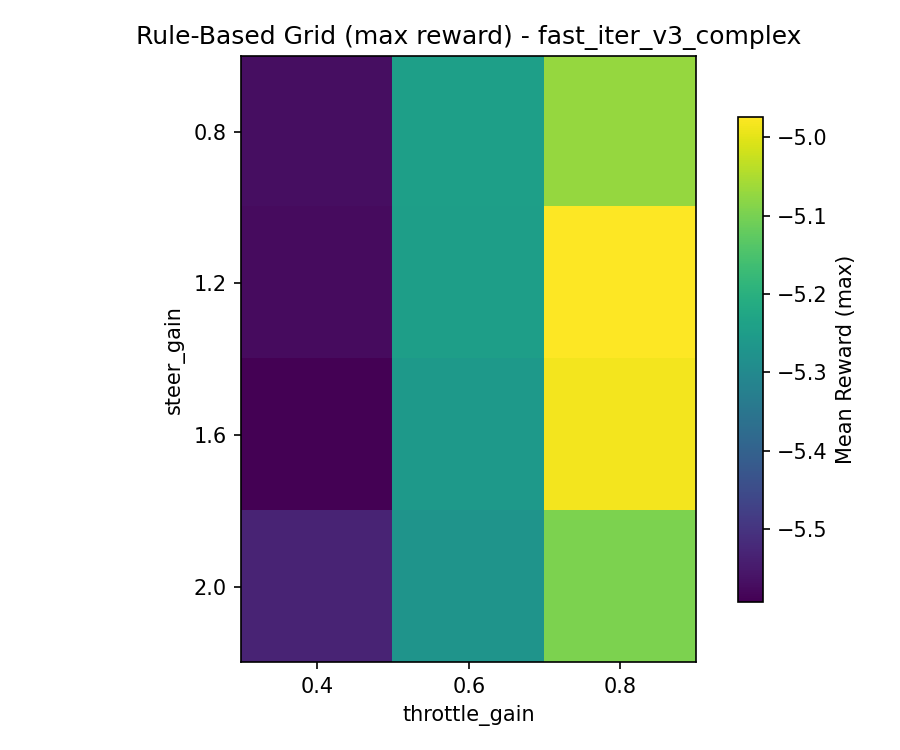

# Rule-Based Baseline: Wavy Track

## Best Params (grid search)
- `steer_gain`: **1.2**
- `throttle_base`: **0.3**
- `throttle_gain`: **0.8**
- `brake_dist`: **0.3**
- `throttle_min`: **0.0**

## Performance (50-episode eval)
- Mean reward: **-4.97**
- Mean checkpoints: **3.0**
- Collision rate: **100%**

## Heatmap

## Interpretation
The rule-based policy over-commits throttle on the wavy sections and collides early. It remains a diagnostic floor rather than a competitive baseline.
